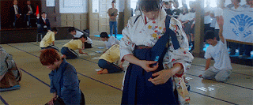
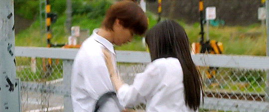
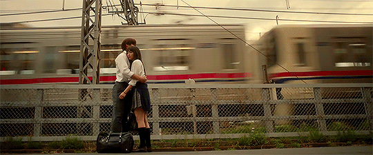
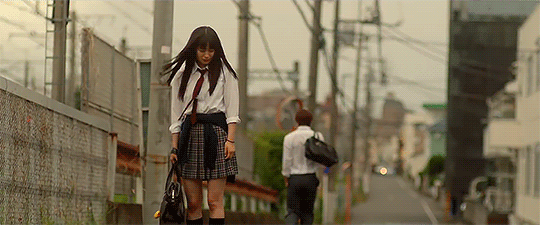
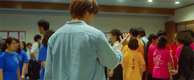

Pertama, di sesi ke 3 ini aku merasa konfliknya sudah menjadi sorotan utama. Aku merasa konflik yang sesungguhnya itu dimulai di serial ke 3 ini. Dimana cinta segitiga di antara mereka mulai menemui titik gregetnya. Uhuk. Selain itu juga, ada banyak qoutes-qoutes menarik yang bisa dipetik hikmahnya.

Di serial ke 3 ini, klub karuta Misuzawa sedang berada di ambang dilema, sebab kepengurusan klub karuta oleh Taichi dan Chihaya di ambang akhir masa kepengurusan sebab mereka sudah berada di kelas XII, sebab itu harus ada regenerasi klub untuk angkatan seterusnya agar klub karuta di sekolah Misuzawa tetap ada. Nah, di saat itu juga mereka harus memfokuskan diri memilih masa depan mereka, dengan arti lain mereka harus memikirkan kuliah, bukan hanya soalan organisasi atau hanya berfokus pada klub.

Diantara mereka bertiga yang paling jenius itu Taichi. Taichi pula lah yang menerima tekanan paling kuat dari orang tuanya, orang tua Taichi menginginkan dan memintanya untuk berhenti dari klub karuta agar Taichi bisa lebih fokus belajar agar ia bisa kuliah di fakultas kedokteran di Universitas Tokyo. Selama kelas XII Taichi mulai mengikuti les bimbel gitu dan itu otomatis mengurangi waktunya bersama klub karuta. Masih ingatkan, kalau Taichi itu ketua klub karuta SMA Misuzawa?


Kesempatan itu tidak ada knop pintunya. Kamu takkan bisa membukanya sendiri. Terserah padamu apakah kamu akan melompat masuk dengan cemas, saat seseorang membukakannya untukmu, atau saat hatimu sudah siap.


Dan di hari itu sampai detik itu juga Chihaya belum memikirkan tujuan hidupnya untuk kedepannya. Ia terlalu nyaman dengan karuta dan merasa karuta sudah cukup baginya, sedangkan klub bukanlah suatu yang baik untuk kehidupan di masa depan. Chihaya harus punya cita-cita dan pekerjaan untuk bisa membiayai hidupnya. Detik-detik itu pula adalah masa-masa Chihaya mendapat teguran oleh guru pengasuh klub, Chihaya dinasehati untuk tidak begitu mengganggu Taichi, sebab Taichi sedang mempersiapkan diri untuk kuliah di Universitas Tokyo.

Karena kepopuleran klub karuta Misuzawa yang merupakan salah satu ktdaklub terkuat se Jepang, membuat Chihaya dan Taichi terlihat seperti pasangan oleh junior di sekolah mereka. Bagi junior kelas, Taichi dan Chihaya adalah pasangan yang serasi, sangat serasi sekali. Chihaya sangat cantik dan Taichi juga tidak kalah mempesona. Tapi sebenarnya kejadian tidak demikian, Chihaya masih belum menyadari perasaan Taichi karena Taichi memang tidak pernah menyatakannya. Taichi hanya menyimpan harap dan dengan doa.

Sedangkan di awal pembukaan serialnya, mereka ngikutin lomba gitu kan. Disaat itu Arata ada di sana, terus mereka bertemu dan arata bilang,

Arata: Chihaya. Sebenarnya, aku ada hal lain yang ingin aku lakukan tahun ini. Aku ingin membentuk klub karuta. Aku ingin bermain melawan tim-u di sini, di Omi Jingu.

Chihaya: Bagus sekali! Itu berarti kita bertiga akan bisa bermain karuta bersama lagi.

Arata: Aku mencintaimu, Chihaya.










Nah, di saat itu si Taichi ngeliat dan menyaksikan yang terjadi di saat itu walau dia tidak tau secara pasti apa yang sedang mereka bicarakan, terlihat jelas bahwa wajahnya Taichi cemburu, dan ekspresinya si Taichi saat itu, masya Allah..

Nah, itu adalah salah satu kejadian yang membuat Chihaya semakin dalam menyelami karuta padahal sudah di ambang SMA. Dan hal itu pula yang menjadikan sinar Taichi semakin meredup di hati Chihaya. Aku merasa sampai di saat ini Chihaya masih mengharapkan Arata dan padahal nih ya, yang selalu bersama dan berjuang dengannya adalah Taichi. Ini endingnya nanti Chihaya akan bersama siapa sih?

Akhirnya, setelah perjalanan panjang, akhirnya ada dua siswa yang bersedia masuk ke klub karuta Misuzawa. Ada sepasang siswa lelaki dan perempuan yang akhirnya bergabung dengan obsesinya masing-masing. Si lelaki yang satu memang berbakat bermain karuta dan si perempuan yang satu tujuannya adalah agar bisa dekat dengan Taichi, dia adik kelas yang suka dengan Taichi-.-

Di sudut Arata, juga ada seorang gadis yang dijuluki junior queen karuta yang ia juga menyukai Arata dan bahkan tanpa malu selalu mengungkapkan cintanya pada Arata dan meminta Arata menjadi kekasihnya dan Arata selalu menolaknya dengan dalih; aku sudah punya perempuan yang aku cintai.

Entah kenapa, Arata selalu dikelilingi oleh pemain terkuat karuta yang terkenal. Dan walau Arata vakum selama beberapa tahun dari dunia karuta, ia tetap saja menjadi lawan yang diingat dan disegani, mendengar namanya saja semua orang akan mengenalinya. Ini aku penasaran kenapa bisa begitu.

Perjalanan regenerasi klub sangat panjang, sampai akhirnya klub bisa terbentuk latihan dan solid, yang sayangnya tidak ada Taichi di dalamnya, semua usaha Chihaya dan tim yang lain. Taichi menghilang dari peredaran klub yang rupanya ia diam-diam mengambil les bimbel untuk masa depannya.

Di saat sedang bimbel pernah satu waktu Arata menghubungi Taichi untuk bertanya, bagaimana caranya membentuk klub, Taichi hanya bilang semua berkat Chihaya bukan ia yang membentuk klub karuta misuzawa melainkan Chihaya. Arata bilang dia juga ingin membentuk klub gitu. Taichi cemburu dan ia memilih menyibukkan diri tanpa Chihaya di dalamnya juga otomatis melupakan karuta.

Taichi mulai melarikan diri dari Karuta dan tidak pernah lagi mengikuti perlombaan apapun bersama klub. Taichi benar-benar menghilang dan hanya teman klubnya selain Chihaya yang mengetahui kabarnya. Selama ini juga Taichi meminta pada temannya untuk merahasiakan apapun yang menjadi pilihan hidup Taichi. Semua temannya yang lain tau kalau Taichi sedang berupaya untuk bisa diterima di Universitas Tokyo.

Walau sebenarnya diam-diam Taichi juga berusaha mendalami karuta di tengah waktu luang yang ia miliki. Ia mendatangi Sou-san yaitu sosok lelaki dengan sebutan King Karuta. Si King ini sangat kuat, dia tidak tertandingi dalam permainan karuta secara individu, karena King tidak bermain tim.

Saat Taichi memutuskan atau meminta si Sou-san untuk bermain karuta melawan Arata agar Sou-san bisa menemukan saingan yang tepat untuknya dan agar Sou-san tidak berhenti bermain karuta, Sou-san bilang:

> “Bermain karuta dengan orang yang menyukai karuta dengan segenap jiwanya itu melelahkan. Aspek itu yang aku suka darimu Taichi, kau tidak segenap hati.”

Nah, Sou-san tahu kalau selama ini Taichi tidak segenap hati atas karuta, Sou-san lebih ingin bisa bertanding dengan Taichi daripada yang lain. Baginya Taichi menarik ia memiliki kekuatan yang lebih besar dalam dunia karuta dibanding yang lain karena bisa menang dalam karuta walau ia tidak mencintainya segenap jiwa.


Fase yang penting untuk masa depan~


Selama Taichi menghilang, selama Taichi tidak lagi ikut bertanding bersama klub mereka, Chihaya selalu menyebut nama Taichi sebagai mantra kemenangannya. Di sesi pertama mereka gagal namun di babak kedua mereka masuk final. Itu tandanya klub SMA misuzawa lolos masuk ke Omi Jingu yang sebenarnya itu adalah Omi Jingu terakhir mereka sebagai siswa sekolah. Karena tahun depan mereka akan lulus sekolah.

<figure>
  
  <figcaption>Punya Taichi dipakai Chihaya (:</figcaption>
</figure>

Chihaya bener-bener kesal dan marah pada Taichi karena Taichi menghilang begitu saja di momen-momen genting seperti ini.

Hingga hari itu saat mereka bertemu bersimpangan jalan di seberang rel kereta. Chihaya marah dan kesal pada Taichi.

Chihaya: Peringkat kedua! Berkat Tsukue-kun, kami berhasil menembus kejurnas.

Taichi: Selamat. Semoga berhasil ke kejurnas.

Chihaya: Kau bercanda. Ini tidak lucu sama sekali. Jangan lakukan ini Taichi! Tidak mungkin bagimu berhenti dari klub begitu saja (mata sembab). Kenapa? Kenapa? Kau bodoh. Kau akan menjadi Taichi bodoh (orang Jepang suka banget yaa bilang bodoh kalau marah)

Taichi: Aku bermain karuta untukmu. Aku mendirikan klub karuta untukmu. Tapi aku tak bisa lagi melakukannya.














<figure>
  
</figure>
<figure>
  
</figure>


<figure>
  
  <figcaption>Kyaaaa...</figcaption>
</figure>
<figure>
  
</figure>


Sedih aja, kenapa harus Taichi yang selalu mengalah. Mungkin ini agar konfliknya menjadi seru.

Sejak saat itu mereka saling dilema.

Btw, kok aku semangat gini yaa ngereviewnya -.- padahal ngga ada yang nyuruh juga. Ngga dinilai juga.

**Hidup harus berlanjutkan?** Nah di saat itu pula Chihaya terus berlatih walau hatinya selalu dirundung sedih karena kenangan-kenangan bersama Taichi yang terus terngiang. Taichi juga terus mencari papa yang menjadi tujuan hidupnya dan bisa tetap untuk tidak meninggalkan karuta.

Di hari kejurnas Taichi benar-benar tidak datang. Aku nangis dibagian ini. Chihaya selalu keren beud!

Ada yang qoutes yang menarik dari kedekatan Taichi dan Sou-san, yakni:

> “Tolong jangan lupa, bahwa kita memiliki kekuatan untuk selalu menghentikan waktu.”

Di hari kejurnas tersebut ternyata klub karuta Arata berhasil mengalahkan SMA Hokuo, SMA yang selama ini menjadi saingan SMA Misuzawa. Keren!

Setelah menerima petuah panjang dari Sou-san akhirnya Taichi memutuskan datang ke pertandingan Omi Jingu. Ia ingin menghentikan waktu: untuk masa muda yang ia miliki. Ia tidak ingin menjadi seperti Sou-san yang kehilangan masa mudanya karena terlalu tenggelam pada mimpi yang ingin ia capai. Padahal untuk urusan mimpi ada banyak jalan menujunya, tapi masa muda yang berlalu tidak akan pernah terulang.

<figure style="text-align: center;">
  
</figure>

Taichi memutuskan datang mengikuti Omi Jingu Chihaya nangis pas tau si Taichi akhirnya datang mengikuti kejurnas terakhir mereka. Dan selama ini ternyata Chihaya selalu pakai tali namanya Taichi:’) Masya Allah Chihaya. Sweet banget sih.

> “Orang yang benar-benar kuat adalah orang yang bisa menjadikan orang-orang disekitarnya kuat. Mereka memberikan harapan pada juniornya. Mereka menaruh hormat pada rivalnya. Mereka memberi semangat pada teman setim-nya. melintasi ruang dan waktu mereka akan menjadi abadi.” – Sou-san.

Dan jawabannya adalah Chihaya.






Dan hari itu mereka menjadi juara pertama mengalahkan klub karutanya si Arata. Keren!

Akhirnya semua orang tau bahwa perempuan yang disukai oleh Arata adalah Chihaya, dan juga Taichi. Dan bagi Arata tidak mengapa kalah asal bisa rival bersama lagi.



Akhir kisah, Chihaya senang karena Taichi akhirnya bersamanya. Taichi tau kalau Chihaya belum mengungkapkan perasaannya pada Arata. Hari itu Taichi setrong banget meminta Chihaya untuk menyelesaikan urusan hatinya pada Arata, ditemani Taichi. Chihaya ngga peka guys, endingnya belum ada kepastian dari Chihaya dan mereka akan bertanding karuta lagi di serial selanjutnya, masih bersambung...

Dan ngga tau harus nunggu sampe kapan.

Btw, seru. Nonton deh. Ada part-part epic yang ngga aku sampein di sini. Spoilernya masih jauh dari kata sempurna, lebih sempurna kalau nonton sendiri.
